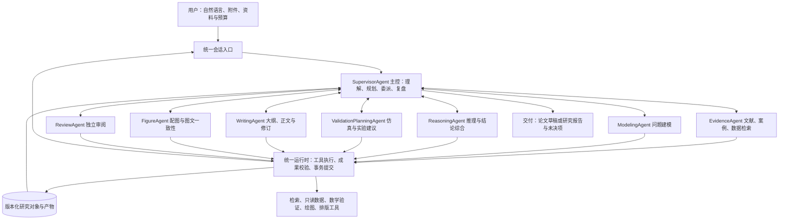

# AI for Research(AIR)智能体团队合并计划

更新日期：2026-10-04

目标架构：**主控智能体 + 各功能子智能体 + 共享研究状态 + 受控工具与验证模块**。

审查基线：本地提交 `505b388`，并对照初版合并计划、当前两张图及其调用代码。本文件是后续合并实施的主计划；文中标为“目标”“新增”的模块与接口尚未实现。

## 1. 本次调整的方向

用户输入自然语言研究任务、精准问题附件或已有研究资料。主控智能体应理解研究目标、问题类型与成功条件，自主安排文献/案例/数据检索、问题建模、推理与结论综合、验证方案、论文写作、配图和独立审阅。在新证据、推理失败或审阅意见出现后，主控重新派工，直到得到可交付成果或明确的未决结论。用户无需先选择“综述模式”或“理论模式”，也无需逐步指挥每次检索和工具调用。

初版计划的能力复用方向可以保留，但必须调整以下设计：

1. **将主控本身定义为智能体。** 它负责意图理解、任务分解、依赖规划、委派、结果验收和重新规划；`SessionController` 仅负责会话生命周期，不能代替科研主控。
2. **外层使用动态派工循环。** 原计划的“检索→建模→推导→写作→配图→审阅”只是一种可能轨迹。每个子智能体完成或受阻后都回到主控，主控可以补检索、换模型、返修某一段、重画某一图或部分交付。
3. **统一团队，保留任务差异。** 综述、形式化证明、机理研究、案例比较和验证方案共享入口、团队与资料体系，但不强制使用同一研究方法、章节模板或判定标准。
4. **区分智能体的科学判断与程序维护的状态。** 建模、推理和审阅智能体需要解释、综合、质疑并提出结论；系统统一核查这些结果的来源与等级，再写入权威状态。程序规则能保证记录与条件一致，无法自动保证任意自然语言论证都科学正确。
5. **将案例与数据纳入检索职责。** 仅合并论文检索还不能满足目标。新增案例卡与数据卡，复用现有只读 CSV/SQLite 能力，并提供明确的资料权限、版本和查询范围。
6. **按需人工介入。** 关键歧义、超出已授权范围或确实需要领域判断时请求人工；清楚且已授权的任务自主推进。取消默认每阶段确认和本轮不需要的“投稿确认”节点。

本轮仍以研究、检索、推理、写作与审阅为范围；仿真/实验先产出实施建议。数据检索包含授权资料的只读查询与结构检查，不自动扩大为新实验、训练或仿真执行。已有统计工具保留为受任务契约约束的可选能力。

## 2. 当前源码：可以继承什么，需要纠正什么

以下为当前代码核对结果，不以文件名是否带 `agent` 判断能力，也不把历史测试数量当作本次复测。

| 位置与实现 | 当前实际能力 | 合并中的判断 |
|---|---|---|
| `src/graph/pipeline.py::_extract_research_plan()`、`supervisor_node()` | LLM 提取主题/关键词，但主控按 `stages/stage_index` 顺序派发 `research/write/figures` | 复用意图提取与输入规范化；重写科研派工逻辑 |
| `src/research/proposal.py::make_proposer()`、`coordinator.py::decide()` | 已有 LLM 下一动作提议、对象版本检查、前置条件与规则回退 | 是新主控的规划基础；需从“挑一个理论动作”升级为“安排团队子任务” |
| `src/research/loop.py::TheoryEngine` | 编排、研究对象变更、动作实现、记账、验证、冻结等集中在一个类 | 按职责逐步抽出；最终不能继续作为主控下面第二个全权总控 |
| `src/agents/literature_reviewer.py::_run_agent_loop()` | 已有工具调用→观察→再决策；检索还固定要求至少 30 篇，默认时间范围偏综述 | 复用工具循环机制；按研究缺口和任务类型决定查询、时间范围及停止条件 |
| `src/kb/bridge.py`、`kb/service.py`、`research/query_planner.py` | 指定库/自主检索、定位阅读、来源摄入、覆盖记录与定向查询 | 与综述检索合并成统一检索能力，避免两套查询与证据缓存 |
| `loop.py::_retrieval_requests()`、`_literature_impact_recheck()` | 已改用 `retrieval_available`；已有研究中检索后的文献影响重检 | 上版“无 KB 必然不生成检索请求”已被修复，应保留回归；合并时扩展为任务级资料需求 |
| `research/derivation.py::plan_derivation()`、`evidence.py::build_support_judge()` | 除动作提议外，已有 LLM 推导与证据语义审读 | 初版“理论侧只有 1 个 LLM 控制器”的表述不准确；这些能力应归入具体子智能体 |
| `question_planner.py::formulate()`、`modeling.py::synthesize_models()` | 问题类型/模型提取仍有较多关键词与规则路径；`formulate` 接收 `llm` 但当前正文未用它做语义分类 | 引入主控语义理解与建模子智能体；规则保留作结构校验、已知形式解析和回退 |
| `agents/outline_generator.py`、`paper_writer.py`、`paper_reviewer.py` | 可生成大纲、长文、修订契约与问题账本，但提示与评价偏综述 | 核心能力复用；改成任务画像和稿件角色驱动 |
| `agents/theory_writer.py`、`research/writing_bridge.py`、`publication_paper.py` | 结构化事实渲染、追溯映射、论文模板；LLM 长文仍只作附录，部分内容硬编码组合设计 | 事实/证书渲染保留；主文统一由写作智能体形成；清除通用入口的领域假定 |
| `rag/figure_generator.py::generate_figures_from_notes()`、`figure_llm.py` | 有绘图、代码修订和视觉审阅；当前入口固定生成多类图，包含 `generate_rf_pipeline()` | 改成配图智能体按论证需要选图；保留绘图实现，不再自动给所有领域画识别流程图 |
| `research/store.py`、`dependency_graph.py`、`verification/` | 已有版本化对象、事件、幂等提交、验证与依赖失效 | 作为共享研究状态和工具模块保留；补团队并发提交语义 |
| `server.py`、`web/src/app.ts` | 会话按模式建图，SSE 与前端上下文仍有多会话问题 | 新统一入口复用服务基础；同步修复事件与状态归属 |

初版将“单会话删除清空共享库”标为已修，需要收窄结论：当前 `_cleanup_shared_retrieval_resources()` 只在发现**同一项目**仍有会话时保留库，否则仍清理全局 Chroma collections。不同项目共享底层库的情况仍需修复。当前 `_run_session()` 还替换进程级 `sys.stdout`，`cost_tracker.tracker` 与 `session_memory.json` 也是全局资源；团队并发前必须处理其会话归属。

## 3. 目标团队与运行形态

默认建立 **1 个主控角色 + 7 类功能子智能体**。角色数不等于常驻进程数，也不要求使用七种不同模型；每个角色应有独立职责、上下文、工具集、任务循环与成果契约。初期同进程运行即可，后续按需要扩展 worker。



外层图只有一套团队编排入口；子智能体内部可以有工具循环或子图。不能以“只有一张图”为理由删除专业子流程，统一的是用户入口、委派协议与权威状态。Session 管理运行，Supervisor 管理科研决策，两者职责分离。

### 3.1 职责、输入和成果归属

| 智能体 | 输入与自主职责 | 必须提交的成果 | 可复用能力 |
|---|---|---|---|
| **SupervisorAgent 主控** | 用户请求与附件候选需求、权限、当前成果与缺口；识别任务类型、拆子问题、安排依赖/预算、验收与重规划 | `ResearchBrief`、版本化 `TeamPlan`、`AgentTask`、`SupervisorDecision`、交付说明 | 综述 planner；`proposal/coordinator/context/routes/intent/capability` |
| **EvidenceAgent 检索与证据整理** | `EvidenceNeed`；自主决定查询、资料源、阅读与扩展检索；覆盖文献/案例/数据 | `EvidenceBundle`：来源卡、案例卡、数据卡、精确定位、支持/冲突候选、覆盖与缺口 | `literature_reviewer`、`pdf_ingestor`、`kb/`、搜索/PDF 工具、`query_planner` |
| **ModelingAgent 问题建模** | 研究契约与可定位资料；提取变量、量纲、域、约束、机制与假设，比较候选模型 | `ModelProposal`：数学/概念模型、形式化映射、假设来源、模型比较、待核查条件 | `question_planner`、`problem_formulator`、`modeling`、`capability` |
| **ReasoningAgent 推理与结论综合** | 子问题、模型、前提、已有结果；分解义务、推导、查反例、综合文献/案例并回答问题 | `ReasoningResult`：推导链、命题候选、工具请求/记录、结论建议、局限、补检索请求 | `derivation/theorist/critic/novelty/novelty_compare/argument`，现有理论动作实现 |
| **ValidationPlanningAgent 验证方案** | 未决义务、竞争模型、资料/参数约束；判断什么验证能区分解释 | `ValidationPlan`：仿真/实验实现建议、变量/单位、参数来源、对照、指标、判据、预算与停止条件，标为未执行 | `experiments/planner.py`、`schemas.py`、`validator.py` |
| **WritingAgent 写作** | `WritingPacket`：任务画像、结果快照、来源与图表引用、审阅意见；设计大纲、写正文、局部修订 | 版本化 `Manuscript`、块级论断映射、`WritingGap`、图表需求、修订说明 | `outline_generator/paper_writer`、`theory_writer` 的素材构建、`writing_bridge` |
| **FigureAgent 配图** | 论证结构、来源数据、公式/模型、图表用途与版面要求；选图、绘图、修正 | `FigureSpec`、SVG/PDF/PNG 等产物、数据与脚本引用、图注、代码/视觉核查结果 | `rag/figure_generator/figure_llm/figure_style` |
| **ReviewAgent 独立审阅** | 原任务、当前稿件/图表、研究快照与原文；检查科学逻辑、问题忠实度、引文、可读性、图文一致性 | `ReviewReport`、稳定 `ReviewIssue`、需返工对象/职责、验收标准及是否阻断交付建议 | `paper_reviewer/citation_checker` 的语义审阅；`adversarial/critic` 的检查项 |

**案例/数据检索的具体归属。** 第一版由 EvidenceAgent 的 `literature/case/dataset` 三种任务配置承担，共用来源身份、权限和检索记录。论文输出作者/版本/定理定位；案例输出情景、干预、结果、限制和类比条件；数据输出出处、许可、schema、单位、时间范围、缺失情况、hash 与查询记录。不能把案例当成定理证明，也不能仅因有一张数据表就认定能识别因果效应。任务大时，主控可并行派发多个 EvidenceAgent 实例，各自领取明确范围；不要求先堆出三个空壳 Agent。

**推理能力覆盖综述。** 综述仍需要主题归纳、定义比较、证据冲突解释与研究空白综合，这归 ReasoningAgent 的 synthesis 任务。纯文献清单可跳过；完整综述不能默认“检索完直接写”。形式化证明只是 ReasoningAgent 的一种策略，不能把所有研究问题都强制转成 SymPy 可解的式子。

**审阅与状态权限。** ReviewAgent 可以质疑推导、要求补证据或建议否定命题，但不直接修改命题真值。运行时可先阻断受影响的交付，再派证据/推理复核并由状态规则更新等级。WritingAgent 可以要求补研究；FigureAgent 可以发现数据缺口；它们都向主控返回请求，不越过任务权限改研究结论。

### 3.2 保持为工具或确定性模块的功能

搜索后端、PDF 获取/解析、向量检索、只读 SQL/CSV、来源去重、SymPy/Z3/Lean/统计检查、证书重算、引用编号、排版编译、存储与事件投影保持工具或模块。智能体决定何时调用和如何解释结果，程序保证执行范围、记录完整与状态规则一致。

“有可定位引文”“引用元数据真实”“引文支持当前前提”“命题在该前提下成立”是四个不同判断。语义支持评审允许用模型，但必须记录为评审结果；不能因为中央规则无 LLM 就声称自然语言语义已经被形式证明。正式证明、符号核验、文献支持、独立审阅、条件性推断与未决状态分别呈现，复用现有 `Assurance/SupportKind/ValidationStatus`，需要扩展时提供明确映射。

## 4. 主控如何理解任务并自主推进

### 4.1 从二选一模式变为可组合任务画像

主控先产出 `ResearchBrief`，至少包含：原始请求与附件来源、主问题/子问题、研究对象、需要回答的判断、约束与量词、已有成果、资料权限、输出要求、成功条件、未知字段及识别依据。输入精确时保持用户的定义和边界；输入仅是方向时，自主发现相关研究并提出少量有区别的路线。

画像分开记录三个维度，避免用一个 `survey/theory/hybrid` 枚举决定所有行为：

| 维度 | 示例 | 对执行的作用 |
|---|---|---|
| 问题/子问题类型 | 文献综合、存在性/证明、机理解释、模型构造、案例比较、数据可用性分析、验证方案 | 选择子智能体的研究策略及判据；一个任务可有多类子问题 |
| 用户需要的交付 | 文献清单、问题报告、理论结论、完整论文草稿、图表、审稿意见 | 决定是否需要写作/配图/完整审阅 |
| 授权与能力 | 指定库/外部检索、只读数据、可用验证后端、预算、只做验证建议 | 限定可派发任务和工具；不能由智能体自行扩大 |

`question_planner.formulate()` 的规则分类作为检查与回退；主控语义提议必须通过同一契约校验，LLM 不能绕过量词/域/方法限制。无法确定的字段保留未知，不因一个关键词强行设成因果研究。仅在不同答案会改变目标、方法或授权时澄清；其余在已声明的假设下推进并显示依据。

### 4.2 主控循环与子任务图

主控每轮读取当前 `ResearchBrief`、相关对象、待办/运行中任务、结果与缺口、剩余预算，再给出以下一种结构化决策：`dispatch`（派一个或一组任务）、`request_clarification`、`wait`、`deliver`、`stop_with_report`。每次派工必须说明要回答哪个子问题、预期获得什么新信息、依赖哪些结果、什么算完成、失败如何处理。

运行时验证决策、保留预算并派发任务；子智能体完成后提交成果或受阻原因；运行时校验并登记结果，主控评估缺口是否减少，再决定下一步。子任务图记录依赖，不能把旧 `stages` 列表换个名字继续线性运行。

- **可以并行：**不同资料源的检索、互不依赖的子问题推导、已冻结事实上的独立审阅、依赖稳定数据的多个图表。
- **应当串行：**结论前提变更与其依赖的推导、证据未定时的强结论写作、稿件修改与同一版本的最终审阅。独立章节可并行初稿，但由一个 WritingAgent 合稿并检查定义/符号/交叉引用。
- **受阻处理：**工具故障可有界重试；缺来源派检索；缺模型条件派建模；出现反例派推理修订；缺经验支持派验证方案；没有新信息的重复调用停止。AgentTask 完成不表示主问题已解决。

### 4.3 三条必须能跑出的协作轨迹

| 用户任务 | 主控应形成的轨迹 | 关键要求 |
|---|---|---|
| “总结某方向的研究进展并写综述” | 检索 → 综合证据/分类与冲突 → 写作大纲 → 写作/配图 → 审阅 → 定向修订 | 综合结论有原文依据；不强造数学证明或实验结果 |
| “判断给定安排是否存在，给严格证明” | 精确形式化与必要的定理检索 → 推理/验证 → 核查定理适用性 → 写作 → 审阅 | 能在推导中请求补查；已知定理应用与原创结果分开 |
| “解释某机理，参考案例和数据库，并提出验证办法” | 检索文献/案例/数据 → 建模比较 → 条件性推导 → 验证建议 → 写作/机制图 → 审阅 | 不把案例类比当普适证明；未运行的仿真/实验只列建议 |

例如推理智能体返回“引理 L 缺适用条件”，主控应派 EvidenceAgent 查该条件，并让 ModelingAgent 核对与原题是否一致。若模型从 v2 变 v3，旧证明、相关段落和图表标为 stale；重新核验后才派写作更新。审阅发现同一问题时，也沿此路径返工，不能仅让 Writer 润色句子。

## 5. 统一智能体协议：派工、成果与协作请求

建议在 `src/agents/protocol.py` 定义契约，`runtime.py` 提供统一执行机制，`registry.py` 注册角色与真实可用能力。复用 `_run_agent_loop()` 的调用/观察模式，但须去掉硬编码 `_TOOL_MAP`、`all_papers`、全局 tracker 和消息条数停止逻辑；不直接复制为通用循环。

以下为拟议接口示意，不是已存在的代码：

```python
class AgentTask(BaseModel):
    task_id: str
    agent: str
    objective: str
    project_id: str
    problem_id: str
    run_id: str
    branch_id: str
    plan_version: int
    input_refs: list[ObjectRef]       # 版本化、限定范围的研究对象
    depends_on: list[str]
    acceptance_criteria: list[str]
    capability_grant_id: str         # 运行时签发，模型不能自行扩权
    budget: TaskBudget
    idempotency_key: str

class AgentResult(BaseModel):
    task_id: str
    agent_run_id: str
    outcome: Literal["completed", "partial", "blocked", "failed", "cancelled"]
    summary: str
    input_versions: dict[str, int]
    artifact_refs: list[ArtifactRef]
    proposed_changes: list[ChangeProposal]
    verification_refs: list[ObjectRef]
    followup_needs: list[ResearchNeed]
    unresolved: list[str]
    usage: UsageRecord

async def execute_agent(task: AgentTask, context: ContextPack,
                        runtime: AgentRuntime) -> AgentResult: ...
```

`TaskBudget/ArtifactRef/ChangeProposal/ResearchNeed/UsageRecord` 需正式定义；以上省略字段默认值，仅用于固定设计。工具调用生成单独记录，工具执行失败、解析失败、任务完成和科学结论未决须可区分。

### 5.1 子智能体必须具有的行为

每个子智能体收到目标后，在自己的预算内进行“理解子任务→选择工具/下一步→读取观察→调整→提交结构化成果”。工具失败可以修正输入并重试；输出不合规可以在小额度内修复。单次 LLM 提示可作为简单任务的一种实现，但不能成为所有复杂研究任务的唯一执行方式。

局部决策归子智能体，例如改检索词、分解引理、局部重写、重画图。跨职责需求返回 `ResearchNeed`，由主控转换成新 `AgentTask`；第一版不开放子智能体任意互相派工或无限再生成团队。ReviewAgent 从原始任务、成果与证据独立审阅，不只接收作者的自评结论。

### 5.2 状态提交与权限

智能体只读所需上下文，通过工具与 `ChangeProposal` 提交候选成果。运行时检查 schema、对象归属、输入版本、资料权限、工具记录、证据与依赖后，通过统一状态提交模块写入。不能只靠 `may_change_conclusion=False` 布尔标记或提示词约束；工具注册和存储入口必须实际限制写入。

推理智能体可以提出“在 A、B 前提下结论 C 成立”并给推导；审阅智能体可以提出“该结论存在反例”。程序维护的 `supported/refuted/blocked`、验证等级、交付状态只能由受检验的记录和明确规则产生。没有适用形式工具的自然语言论证可以交付为待审/条件性结果，并保留独立审阅；不把整个科研能力限缩成求解器支持的题型。

现有 `derivation.py` 对“已证明/QED”等文字的直接拒绝也需随协议调整：科学文本中的证明主张应成为待核验内容，不能单凭措辞决定真伪或丢弃完整推导。真正受限制的是越权写状态、引用不存在的工具结果、缺失前提与证据；文本风险检查可以保留为提示，再结合结构化字段和核验记录判定。

### 5.3 预算、取消与记录

全局 run 预算向任务分配额度，派发前预留，并发任务不能各自认为拥有完整余额。记录实际调用、token、费用估计及其缺失状态；调用失败或取消仍计入已发生费用。记录 `agent/task/agent_run/prompt_version/model/tool_run/input_versions/output_hash`；主控看到有依据的决策摘要，不需要向所有角色广播完整聊天历史。

停止 run 时取消尚未派发的任务、通知运行中任务停止，并封存已有成果。恢复时跳过已提交的幂等任务，识别未完成工具调用；不能简单重新执行整个子图。重试使用原任务 ID 与新的 attempt/agent_run ID，防止重连或超时触发重复付费调用。

## 6. 统一状态、资料与产物

### 6.1 一份研究事实，图状态保存引用

保留 `ResearchStore` 的版本化对象与事务机制，把综述的文献综合、文稿、审阅问题、图表也登记为研究产物。LangGraph 状态保存身份、计划版本、任务 ID/状态、对象版本与产物指针；全文、论文正文、代码和大批检索结果不平铺进入图状态。角色视图由 `context.py` 按任务组装。

初版“信封+载荷”方向可采用，但载荷应主要是引用与摘要，不能在图中复制一份可写的 claims/evidence，再让 SQLite 保存另一份。一次迁移中每种对象必须指定唯一权威写入口，兼容适配器只做受校验的输入/输出转换，不双向同步两个全量状态。

身份关系统一为：`project_id → problem_id → run_id → branch_id/task_id/agent_run_id`；`session_id/thread_id` 管理用户交互与 checkpoint，必须映射到明确 run。运行可包含多个子问题，但每个任务指明作用对象。共享资料按来源集和访问权限管理，不能依赖主题字符串或“最近一次会话”决定使用哪个库。

### 6.2 需要扩展的对象

| 对象 | 复用基础与必要新增 |
|---|---|
| `ResearchBrief/TaskProfile` | 扩展 `ResearchSpec/ProblemContract`，保留原问题、来源约束与确认信息；增加可组合子任务类型和交付要求 |
| `TeamPlan/AgentTask/AgentRun` | 复用动作账本思路；增加职责、依赖、输入版本、验收与预算；任务生命周期为 queued/running/waiting/completed/partial/failed/cancelled |
| `EvidenceBundle` | 复用 `LitRecord/SourceRef/SourceEvidence/EvidenceLink/RetrievalCoverage`；新增案例与数据扩展字段，不再平行定义三份论文身份 |
| `ResearchSnapshot` | 扩展为团队共享的只读研究快照，可含综合结论、模型、义务、资料引用及未决项；纯综述不伪造证明义务 |
| `Manuscript` | 扩展 `rag/theory_render.py::Block/Manuscript`，增加稳定 block ID、论断/来源/图表引用、所依赖版本、段落角色和状态 |
| `FigureSpec/FigureArtifact` | 指定用途、图种、来源数据/公式/模型、单位、图注、脚本 hash、渲染和审阅状态 |
| `ReviewIssue/RevisionTask` | 合并综述 issue ledger 与理论义务/写作缺口；记录受影响对象、负责角色、复核标准与修复证据，科学问题和排版问题分开处理 |

### 6.3 多智能体并发与失效传播

`ResearchStore.put()` 已有 `expected_revision`，但 `submit_step()` 当前不接收整个读取集合的期望版本。要增加事务内 read-set/version 检查：若 Agent 依据 v2 产出时对象已到 v3，拒绝直接合入，记录过期并由主控决定重做或重新核对。只用 Python 锁不能代替多连接/多任务的事务一致性。

首版采用“角色可并发计算、权威提交串行化”，将版本检查、候选接受、依赖失效、事件写入置于同一提交路径。复用 `dependency_graph.py` 与 `_literature_impact_recheck()` 的行为；正文和图表也加入依赖图。纯编辑修改不应重跑全部研究，前提变化也不能只刷新论文标题。

来源 ID/DOI/文件 hash 是稳定身份；`[1]`、图 1 和公式编号只在最终渲染时分配。参考文献重排不改变来源身份，稿件回退须回退对应的参考文献与图表 manifest。

## 7. 代码合并与智能体归属清单

标记：**合并**＝收敛相同职责；**抽取**＝将大文件内能力移到所属模块；**保留**＝工具/领域能力继续使用；**退役**＝替代完成并验证后退出主路径。表中的目标路径均为建议，不要求第一阶段一次性搬完。

### 7.1 主控、建模与研究

| 当前代码/函数 | 处理与目标 | 归属 |
|---|---|---|
| `graph/pipeline.py::_extract_research_plan/_guess_stages/research_planner_node` + `research/question_planner.py::formulate/build_spec_from_input` | **合并**到 `agents/supervisor.py` 调用的统一 intake；从固定综述阶段转成 `ResearchBrief`；已知数学解析保留独立工具 | 主控 |
| `graph/pipeline.py::supervisor_node/route_supervisor` + `research/proposal.py` + `coordinator.py` | **合并/重写**成团队决策；保留有效动作过滤与失败回退，去掉外层 `stage_index` 调度 | 主控 + 运行时校验 |
| `pipeline.py::parse_human_intent/_human_feedback_to_contract` + `research/intent.py` | **合并**为对象/任务定位的反馈解析，保留控制指令和歧义处理；人工修改转成任务或版本变更 | 主控 |
| `research/context.py/routes.py/capability.py/action_registry.py` | **保留并扩展**为角色上下文、能力与局部研究动作注册；团队任务注册与数学动作注册分层，不能全塞一个枚举 | 主控/运行时 |
| `loop.py::_act_propose_model` + `modeling.py` + `problem_formulator.py` | **抽取**到 `agents/modeling.py`，以 LLM 形成模型提案，规则/形式解析检验忠实度与结构 | 建模 |
| `loop.py::_act_plan_proof/_act_derive_step/_act_seek_counterexample/_act_compare_novelty` + `derivation/theorist/novelty_compare` | **抽取**到 `agents/reasoning.py` 的局部任务循环；补文献/案例综合策略，保留已有计算与比较函数 | 推理与结论综合 |
| `loop.py::_act_check_step/_run_tool/_reconcile_claim` + `acceptance.py` | **抽取并保留**为 `research/kernel.py` 与 `verification/`；智能体提交候选与请求，状态按记录更新 | 工具/状态规则，非独立 LLM Agent |
| `loop.py::_act_design_experiment` + `experiments/planner/schemas/validator` | **抽取**为验证方案智能体；当前规则模板作为草稿/校验，增加按具体模型和缺口修订 | 验证方案 |
| `research/design_feasibility.py` | **保留**为组合设计的领域工具；后续通过 `domains/` 注册能力与写作素材，不嵌入通用论文入口 | 推理可调用的领域工具 |

### 7.2 文献、案例与数据

| 当前代码/函数 | 处理与目标 | 归属 |
|---|---|---|
| `agents/literature_reviewer.py::run_retrieval/_run_agent_loop` + `loop.py::_act_retrieve_targeted` + `research/query_planner.py` | **合并**到 `agents/evidence.py`；资料发现、定向补证与综述覆盖共用同一请求/结果协议 | 检索 |
| `literature_reviewer.py::run_notes_synthesis/_synthesize_notes` | **拆分归属**：来源事实摘录留检索，跨论文解释/分类与冲突综合迁入 ReasoningAgent | 检索 + 推理 |
| `research/publication_evidence.py::gather_publication_evidence` | **合并检索部分**到 EvidenceAgent；写作发现缺文献时回主控；相关性和引文转换可保留为工具 | 检索，写作仅提出需求 |
| `agents/pdf_ingestor.py` + `kb/ingest/parse/bridge/service` + `tools/pdf_fetcher` | **统一调用路径**，沿用 KB 的身份、定位和资料权限；原节点改兼容适配器后退役 | 检索工具 |
| `tools/search_tools/chinese_sources/venue_resolver` + `rag/subquery_generator/relevance_filter` | **保留**后端，统一由检索运行时注入；清除固定年份/最低篇数/学科词，补注册型案例与数据源适配器 | 检索工具 |
| `kb/adapters/readonly_data.py` + `kb/sources.py` | **扩展**资料集描述/只读查询，增加数据/案例来源登记、范围与版本；现有论文搜索不等于案例或数据检索已完成 | 检索的数据/案例任务 |
| `research/evidence.py::build_support_judge/assess_support` + `agents/citation_prechecker/citation_guard/citation_checker` + `tools/citation_verifier` | **统一证据与引用核查接口**，保留“身份/定位校验”和“语义支持评审”两种结果；移除重复联网、互相覆盖的可信编号表 | 检索初审 + ReviewAgent 独立复核 + 确定性工具 |

### 7.3 写作、配图、审阅和交付

| 当前代码/函数 | 处理与目标 | 归属 |
|---|---|---|
| `outline_generator.py::run_outline_generation` + `paper_writer.py::run_paper_writing` | **合并**为 `agents/writing.py` 的 plan/draft/revise 任务；按任务画像规划章节，保留局部修订契约 | 写作 |
| `theory_writer.py::build_manuscript/trace_manuscript` + `writing_bridge.py::build_writing_inputs` | **复用并抽取**事实、证明素材与追溯映射到 `publication/inputs.py`；统一 `WritingPacket`，替代综述字典伪装 | 写作输入工具 |
| `writing_bridge.py::append_long_form_appendix` + `publication_paper.py` | **退役“双正文”主路径**，主文交给 WritingAgent，证书保留附录；确定性简报保留降级，组合设计模板移入对应 profile | 写作 + 出版工具 |
| `paper_reviewer.py` + `research/critic/adversarial` + `citation_checker` 的语义意见 | **合并评审产物**到 `agents/review.py`，保留科学/引用/可读性/图表分项检查；不把文本总分作为科学结论证明 | 审阅 |
| `pipeline.py::increment_revision/_build_revision_contract/_resolve_review_suggestions` | **拆分**：问题账本与修改验收归 ReviewAgent，新增文献需求归 EvidenceAgent，派谁修与何时停归 Supervisor | 审阅 + 检索 + 主控 |
| `rag/figure_generator.py` + `figure_llm.py` + `pipeline.py::regenerate_figures_node/_synchronize_figure_placeholders` | **合并**为 FigureAgent 调用的绘图工具；改按 `FigureSpec` 与稳定 ID 绑定图文，复用生成/代码/视觉核查 | 配图 |
| `rag/reference_list.py/reference_formatter.py` | **统一身份与渲染编号**；保留格式器，逐步消除两套编号/去重决定权；不要把两个职责直接拼成大函数 | 出版工具 |
| `rag/theory_render.py/latex_render.py/latex_compiler.py` + `theory_pipeline.py::compile_publication` | **统一文稿中间表示和编译结果接口**；保留公式环境/引用/图表处理，可按文档 profile 渲染；消除重复编译与路径规则 | 出版工具 |
| `research/argument.py/writing_gaps` + `acceptance.py` + `package/reporting` | **保留并扩展**到各任务类型；接收审阅问题与写作缺口，主控决定返工；交付包记录全部团队输入版本 | 状态规则/交付工具 |

### 7.4 会话与基础运行时

| 当前代码 | 处理与目标 |
|---|---|
| `graph/state.py`、`theory_state.py` | 目标由 `graph/unified_state.py` 保存共享身份与引用；迁移适配器按调用点提供所需字段，旧 checkpoint 保持可读 |
| `graph/pipeline.py`、`theory_pipeline.py` | 先抽出已列能力，再由 `graph/research_graph.py` 提供统一主控循环；旧图只服务迁移前会话，不再承接新研究 |
| `server.py::Session/build_initial_state/build_theory_initial_state` + `src/main.py` | 统一 Web/CLI 的 intake 与启动快照；新增任务默认进入统一图，旧 mode 参数转兼容提示 |
| `server.py::session_events/_run_session`、`utils/conversation_store.py` | 抽出会话/事件模块，持久化任务与中断状态、独立 SSE 游标；移除多线程替换全局 stdout 的日志归属方式 |
| `utils/session_memory.py/pipeline_cache.py`、`cost_tracker.py`、`rag/figure_generator.py::_ensure_figure_dir` | 按 run/project/source grant 绑定记忆、缓存、用量和图表目录；禁止依靠全局“最近一次”续研；预算与产物路径显式注入 |
| `research/store.py/dependency_graph.py/input_snapshot.py`、`utils/uploads.py/external_data.py` | 保留可靠基础，扩展事务 read-set、任务成果与失效依赖；附件始终带角色、来源与权限，不因在团队内转交就变成指令 |

“合并”优先合并职责和数据协议，文件移动可以后置。验证器、领域定理、数据读取和编译器已有明确职责，应作为深模块复用；不能为了减少目录数量把它们塞进 Supervisor。

## 8. 建议的项目结构

以下是逐步演进后的布局；第一阶段只创建承担真实职责的文件，其余随能力迁移增加。

```text
src/
  agents/
    protocol.py            # AgentTask/AgentResult/AgentContract
    registry.py            # 角色与真实可用能力
    runtime.py             # 有界工具循环、用量、取消、结构化结果
    supervisor.py          # 理解任务、团队计划、派工与重规划
    evidence.py            # 文献/案例/数据检索任务
    modeling.py
    reasoning.py           # 数学推理与文献/案例综合策略
    validation_planning.py
    writing.py
    figures.py
    review.py
  graph/
    research_graph.py      # 团队外层循环，支持子任务/子图
    unified_state.py       # 小状态：身份、任务、对象/产物引用
  research/
    schemas.py             # 继续承载研究领域对象，按规模逐步拆分
    kernel.py              # 候选接受、验证结果应用、状态与失效传播
    task_store.py          # 团队任务生命周期；复用同一持久化基础
    store.py / context.py / dependency_graph.py / ...
  kb/                      # 文献定位、案例/数据扩展、权限与只读适配器
  verification/            # 保留数学/逻辑/统计工具
  experiments/             # 保留验证建议的 schema 与检查
  domains/                 # 仅迁入确有领域差异的能力，如组合设计
  publication/
    inputs.py              # WritingPacket 与证据/结论素材
    schemas.py             # 文稿块与图表需求，迁入现有 Manuscript
    rendering.py           # Markdown/LaTeX 入口，内部复用现有实现
    gates.py               # 发布检查入口，复用科研与格式检查
  sessions/
    controller.py / store.py / events.py
  tools/                   # 搜索/PDF/绘图等受控工具入口
  rag/                     # 向量与解析等已有实现，按实际归属渐进迁移
  web/src/
    session-controller.ts
    current-research.ts / research-api.ts / contracts.ts
    views/                 # team、timeline、evidence、paper、review
  server.py / main.py       # 薄入口
tests/                     # 现有回归 + 团队协议/调度/迁移/行为用例
evals/                     # 封存题目、资料、行为判据与人工评分
```

角色提示按版本登记，可先与角色实现同目录维护。不要同时新建多个 LLM 工厂、多个知识库真相源或多个通用 Agent 框架；继续复用 `config.build_llm`、LangGraph 和现有存储，通过运行时注入任务配置。

## 9. 前端重构实施计划：统一研究入口与团队工作台

前端的目标是让用户清楚知道：系统如何理解了问题、各智能体正在解决什么、哪些结论可靠、哪些地方需要补充，以及论文为何得到当前结论。前端展示后端产生的任务与研究记录，不自行推断科学结论或在页面内另做一套主控调度。

### 9.1 当前代码问题与技术路线

`src/web/` 已使用 Vite、TypeScript、独立样式和 Vitest/浏览器测试，可以渐进重构，无需把更换 UI 框架作为前置条件。继续采用现有技术栈，先建立可独立渲染/销毁的视图模块、统一 store 与 controller。后续若确有复杂交互需求，再评估视图库，不同时重写状态、后端协议和全部页面。

| 当前代码情况 | 本轮修改目标 |
|---|---|
| `app.ts` 超过 2,000 行，含启动、上传、SSE、历史、工作台、产物与 DOM 绑定 | 拆为会话 controller、输入功能和各研究视图；`app.ts` 最终只负责装配，不保留业务全局变量 |
| `currentThreadId/runMode/currentProjectId/lastEventId/workbenchData` 等与 `window.AIR.research` 同时存在 | 一份前端状态；会话/run 数据、网络连接状态、UI 展开状态各有明确归属，通过动作更新 |
| `contracts.ts` 与 `current-research.ts` 重复定义 `RunMode/RunStatus`，其中后者缺 stopped/error；视图也有重复产物类型 | 统一传输契约、状态类型和视图投影，移除 `any` 事件与响应，未知状态可见且保守处理 |
| `index.html`、`onModeChange()` 以综述/理论控制工作台、资料选择与附件可见性 | 所有新任务使用统一入口，资料和附件始终可见；旧 mode 只进入兼容层 |
| `connectSSE()` 使用全局游标；断线后固定重连；每个 node 事件都可能刷新完整工作台 | 独立事件 controller、会话级游标、连接/执行状态分离、事件去重与有界刷新 |
| `views/*` 目前多为类型/格式化辅助，实际大量 DOM 仍在 `app.ts` | 将实际渲染和局部事件绑定移入视图，保留已验证的纯函数和安全渲染能力 |
| 当前 Markdown 渲染覆盖普通段落/表格等，尚无专门的论文公式与图文追溯视图 | 增加公式显示、图表预览、段落到来源/推导的跳转，以及版本和审阅问题标记 |

### 9.2 页面信息结构与交互

建议保留单页应用，形成“项目导航—研究工作区—上下文详情”的布局。默认聚焦当前研究，不要求用户理解内部对象 ID；技术详情可展开查看。

```text
顶部：AIR | 当前项目 / 研究问题 | 执行状态 · 连接状态 | 预算与停止
┌────────────────┬──────────────────────────────────┬────────────────────┐
│ 项目与历史      │ 主控对研究问题的理解与当前目标    │ 当前所选对象详情    │
│ 新建研究        │ 主控 + 功能子智能体状态条         │ 原文 / 证据 / 推导  │
│ 当前及历史运行  │                                  │ 图表 / 审阅定位     │
│ 查看 / 继续     │ 概览 | 资料 | 研究 | 论文 | 审阅  │                    │
│                │ 当前标签页的时间线、列表或正文    │                    │
│                │                                  │                    │
│                │ 对话与反馈 / 附件 / 资料范围       │                    │
└────────────────┴──────────────────────────────────┴────────────────────┘
```

窄屏改为单主区，项目导航和详情分别用可关闭抽屉承载，保留当前对象选择；不得简单把三列挤成无法阅读的表格。先完成桌面与窄屏线框及正常/受阻/离线状态样例，再实现视图。

| 功能区 | 必备内容与操作 | 数据依据 |
|---|---|---|
| 统一研究输入 | 自然语言、问题/文献/案例附件、数据源选择、检索权限、预算、输出偏好；无需选综述/理论 | 输入草稿、上传结果、SourceSet 与能力表 |
| 问题理解卡 | 原始请求、主控识别的目标/子问题/约束、未确定字段、下一步计划；可局部纠正 | ResearchBrief 与 TeamPlan 的版本 |
| 团队状态条 | 主控决策摘要、各角色待命/运行/等待依赖/等待用户/完成/失败；选中可查看实际任务 | AgentTask/AgentRun；一个角色多个实例时显示任务数而非重复头像 |
| 研究时间线 | 委派→结果→新缺口→重新规划；可按角色、子问题和重要事件筛选 | 持久事件和成果引用；默认折叠底层工具日志 |
| 资料工作区 | 文献/案例/数据分类、来源范围、查询记录、全文/定位、支持或冲突候选、未覆盖内容 | EvidenceBundle、来源卡和 RetrievalCoverage |
| 模型与结论 | 变量/假设/模型比较、命题与推导、验证等级、未决义务、验证建议；可展开依赖链 | 版本化研究对象；首版列表+详情足够，不强制复杂交互图 |
| 论文与图表 | 主文/公式/图表/参考文献、版本选择、对应快照、待核查段落、导出；点击论断或图注查看依据 | Manuscript、FigureArtifact、writing map、manifest |
| 审阅与返工 | 按严重度/负责角色分组的问题、原句定位、验收标准、修改前后差异、处理状态 | ReviewIssue 与 RevisionTask；用户可提出异议或请求重审 |
| 历史与产物 | 区分项目/问题/运行，显示恢复能力；查看、继续、派生新研究和下载 | SessionRecord 与 artifact index，不能从目录名猜归属 |

输入区的“发送反馈”和“回答澄清”明确区分，后者绑定具体 `interrupt_id/task_id`。运行中修改研究范围时，界面显示将影响的任务并提交版本化变更；不能仅改变前端表单却让后台继续旧目标。已完成研究的“继续研究”创建新 run/branch，并展示继承的成果。

### 9.3 状态、路由与会话生命周期

建议以 `state/research-store.ts` 作为唯一状态入口，使用类型化 action/reducer 和只读 selector；沿用 `current-research.ts` 的纯函数思路。服务端是研究事实的权威来源，前端 store 保存其投影与本地交互状态。

- `selection`：当前 project/problem/session/run 和所选任务/对象；切换时整体更新。
- `entities`：按 ID/版本保存任务、证据、结论、稿件与审阅结果；不同 run 分区缓存。
- `transport`：连接中/在线/重连中/离线、最后同步游标、错误、取消请求句柄；与后台 running/waiting/done/stopped/error 分开。
- `ui`：当前标签、筛选、展开项、用户未发送草稿、滚动位置；不能回写命题状态。

统一 `session-controller.openSession(sessionId, intent)`：取消旧 fetch/定时器、关闭旧 EventSource→加载目标会话与投影→原子更新身份→按快照游标订阅事件。所有异步响应携带会话/run key 与加载代号，迟到结果直接丢弃。`view` 只读取，`continue` 才调用恢复；页面刷新、浏览器后退与分享页面地址不自动重启任务。

页面 URL 可保存 session/run/tab/选中对象，用于刷新和深链接；不存在或无归属对象显示明确错误。浏览器持久化只存必要的 UI 偏好和可恢复草稿，不缓存凭据或整份私有来源全文。`window.AIR` 在迁移期提供兼容转发，最终退出业务写路径；不能在兼容对象与新 store 之间双向同步。

### 9.4 前后端契约与事件消费

保持 `/api/sessions` 为统一启动入口。契约定义从后端 schema 导出或进行一致性校验，前端不只写 TypeScript 接口，还需对 HTTP/SSE 的关键字段做运行时解析。历史节点事件先经 `legacy-adapter.ts` 转成可显示记录；新团队协议未就绪时标明旧流程，不伪造智能体状态。

| 请求 | 职责 |
|---|---|
| `POST /api/sessions` | 统一任务、附件、source policy 与预算输入；返回 session/run/问题画像绑定 |
| `GET /api/sessions/{session_id}` | 读取会话、恢复能力、任务画像与快照引用；查看不触发执行 |
| `POST /api/sessions/{session_id}/resume` | 幂等恢复；完成后续研使用新 run/branch |
| `GET /api/sessions/{thread_id}/events` | 保留 **GET SSE**，支持独立游标与重连重放 |
| `GET /api/research/{project_id}/runs/{run_id}/team` | 任务、依赖、状态与预算投影；返回一致快照的 revision/event_seq |
| `POST /api/research/{project_id}/feedback` | 提交绑定问题/run/对象/版本的纠正；与 respond 中断答复语义分开 |

事件统一包含协议版本、`event_id/seq`、session/run、类型、时间、可选 task/agent ID 及产物引用。业务事件包括任务派发/开始/受阻/完成、对象变更、稿件/图表就绪、审阅问题、等待用户和运行终止；工具进度只作辅助。未知事件可记录并重新同步，不能静默让页面变成“完成”。

客户端先读取带游标的投影，再订阅其后的事件；服务端负责重放这一间隙。客户端按 seq 去重，成功应用后再推进游标；发现缺口、日志截断或协议不兼容时重新加载投影。心跳/connected 不占业务事件序号。重连使用有上限的退避和抖动，终止状态/切换会话后取消重连，离线不等于后台已停止。

大事件流按任务/对象做增量更新或合并刷新，只重新渲染受影响面板；滚动查看历史时保留位置并提示新消息。避免每个 token/工具日志触发全工作台刷新。预算或进度未知时显示“未知/待同步”，不能假报百分比。

### 9.5 文件拆分与迁移归属

| 当前文件/函数 | 目标文件（建议） | 迁移内容 |
|---|---|---|
| `main.ts`、`app.ts::boot/bindStaticHandlers/bindDelegatedActions` | `main.ts`、`app-shell.ts` | 创建 store/controller、装配视图和清理订阅；入口不承载研究逻辑 |
| `app.ts::start/onSend/onModeChange`、附件相关函数 + `uploads.ts` | `features/intake/controller.ts`、`views/research-input.ts` | 统一输入、稳定草稿身份、附件绑定与能力提示；删除新入口的模式分叉 |
| `app.ts::switchToConversation/resumeConversation/resumeSession/newSession/stopSession` | `session-controller.ts` | 单一会话操作入口、取消旧请求、查看/继续/停止语义 |
| `app.ts::connectSSE/handleEvent`、`lastEventId` | `events/session-events.ts`、`events/reducer.ts` | 独立游标、解析、去重、重连、事件到状态更新；不直接操作 DOM |
| `current-research.ts`、重复身份变量、`air-global.ts` | `state/research-store.ts`、`state/selectors.ts`；兼容转发保留一段时间 | 一份状态、派生展示数据和历史适配；禁止同步回写两份副本 |
| `contracts.ts`、`views/*` 中重复类型 | `contracts/` 下按 session/team/research/publication 分组，原文件可临时 re-export | 唯一传输类型与运行时解码，视图只定义真正的派生类型 |
| `research-api.ts` 与 `app.ts` 内直连 fetch | `api/research-client.ts`、`api/legacy-adapter.ts` | URL、错误、取消、幂等与兼容集中管理；自动重试限于幂等请求或有幂等键的变更 |
| `app.ts::refreshWorkbench/renderWorkbench/*Detail*` + `views/research-workbench.ts` | `views/research-overview.ts`、`team-board.ts`、`research-timeline.ts`、`object-detail.ts` | 将实际渲染迁出，读 selector，用户操作向 controller 发动作 |
| `renderHistory*` + `views/conversation.ts` | `views/project-navigation.ts`、`conversation.ts` | 项目/问题/run 导航与历史；一套恢复判断 |
| `refreshArtifacts/loadArtifact/renderMarkdown` + `views/artifacts.ts` | `views/paper-workspace.ts`、`figure-gallery.ts`、`review-panel.ts`、`artifacts.ts` | 文稿版本、引用/图文回链、审阅定位与当前 run 产物 |
| `markdown.ts/dom.ts` | 保留并增设 `rendering/math.ts`、`rendering/artifact-preview.ts` | 安全文本、数学和产物预览；不把检索 HTML 或生成 SVG 当页面脚本执行 |
| `index.html`、`styles/base.css/workbench.css/layout.css` | `index.html` 保留壳；按 layout/tokens/components/views 组织样式 | 统一间距、字体、颜色、响应式面板和状态标记；移除大段 inline 布局控制 |

视图应有明确的 mount/update/dispose 或等价生命周期，卸载时清除监听与订阅。用明确的数据与回调传递依赖；文件拆分后若仍互相读取 `window` 上的可写变量，就不算完成状态重构。

### 9.6 论文、证据与图表显示要求

正文默认给出适合阅读的行宽、层级和公式排版。新增本地数学渲染能力，语法失败可回退公式源码并提示，不能破坏整篇文稿。表格与长公式局部滚动，图表可放大；引用、公式、图号与导出稿使用同一稳定对象映射。PDF 编译结果独立显示，浏览器预览成功不等于 PDF 已通过。

论文段落可展开“依据”：关联命题版本、前提、来源页节、工具/审阅结果；图表可查看数据来源、单位、图注与生成记录。稿件所依赖的快照过期时明确标记，并提供请求更新操作。首版通过对象级反馈请求修订，不先引入未设计同步语义的自由富文本协同编辑。

来源卡分别显示“元数据找到”“全文取得”“原文已定位”“支持关系已审读”，冲突与待核对状态可见。案例/数据只能展示当前后端实际提供的能力：如尚无数据上传/查询端点，就显示受支持的资料集选择或不可用原因，不能把扩展名加进文件选择框便称支持数据研究。

保持 `markdown.ts` 的安全渲染行为与来源异常提示。图表通过限定的产物路径预览；新链接、数学或 SVG 处理不得绕过现有渲染与路径规则。状态不能只靠颜色区分，需同时有文字/图标；键盘可到达输入、标签、详情与对话框，关闭抽屉后焦点回到触发位置。

### 9.7 前端执行顺序与后端依赖

前端工作与 M0–M5 并行衔接，不全部留到最后。先用经 schema 验证的固定样例构建正常/空/失败/恢复界面，再接真实端点；测试数据必须明显属于开发环境。

| 前端阶段 | 交付与涉及范围 | 依赖/验收 |
|---|---|---|
| **F0 界面与契约**（约 1 日） | 统一入口、团队工作台和窄屏线框；状态表、样例响应、关键用户路径 | 对接 M0；同一任务在页面里始终对应同一问题/run |
| **F1 状态与会话**（2–3 日） | store/controller、API 取消、统一 openSession、SSE 独立消费、旧模式适配 | 对接 M1/M4；两会话切换、刷新、晚到响应和重连可复现测试通过 |
| **F2 输入与团队视图**（2–3 日） | 统一输入/附件/权限、问题理解卡、团队任务/时间线、真实任务详情 | 对接 M1/M2；已授权清晰问题自主启动，用户纠正可追踪到计划变化 |
| **F3 研究与论文工作区**（3–4 日） | 资料/模型/结论、公式/图表、依据跳转、审阅返工及版本对比 | 对接 M2/M3；从稿件句子回到来源/推导；未决、未执行和 stale 正确显示 |
| **F4 历史与交付体验**（2–3 日） | 历史 run 查看/继续/派生、产物归属、窄屏、键盘导航与长内容优化 | 对接 M4/M5；历史查看不触发运行，产物不串项目，弹层可完整键盘操作 |
| **F5 产物级验收**（1–2 日） | 实际 bundle 与后端联调，删除迁出死代码，保留必要兼容，更新前端 README | 对接 M5；部署产物无路径缺失，所有关键用户路径使用真实打包页面验证 |

前端约 11–16 个有效开发日，为整体重构的一条工作线；与后端并行时不直接相加。F1 的基础状态工作先行，完整持久重放依赖 M4 的服务端事件协议，不能仅凭客户端 mock 宣称恢复已完成。

### 9.8 发布组织与可执行验收

保留 Vite + FastAPI 的部署方式，明确唯一构建 manifest 和发布根。当前构建复制 `dist/assets` 到 `src/web/assets`，HTML 与资源来自不同位置；后续须一起发布匹配版本的 HTML、manifest 与资源。新版本切换原子完成，旧页面仍需的哈希资源按版本保留后再清理，避免构建时删除旧 JS/CSS 导致运行中的研究页加载失败。生产页不直接使用 `/src/main.ts`；缺产物应明确提示构建问题。

| 验收路径 | 必须观察到的结果 |
|---|---|
| 自然语言＋可选附件启动 | 不选择综述/理论也可进入团队；附件、资料权限与任务绑定显示正确 |
| 主控派工、补检索、返工 | 角色状态对应真实任务；可从时间线看到触发缺口和后续处理，不只有“正在思考” |
| A→B 快速切换、慢响应、双标签 | 旧回包/事件不污染 B；各标签获得一致研究事件且不抢占 |
| 断网、刷新、重连、停止 | 连接状态独立显示；业务事件不丢/不重复，中断不重复答复；停止后不无限重连 |
| 推导/证据变更 | 关联论文与图表显示过期；更新后按新版本恢复可交付状态 |
| 长论文、公式、图表、引用 | 页面可读，引用/图注可回链，未知引用有提示；导出与预览版本一致 |
| 历史查看与继续 | 查看只读，继续有明确 run 语义；不把历史稿件标为当前成果 |
| 空数据、接口失败、工具不可用 | 保留已加载的可用内容，显示具体原因和合法后续操作，不默认为成功或静默空白 |
| 桌面/窄屏/键盘与打包页面 | 不溢出主要布局，操作可到达；bundle 使用同源资源，来源文本不能执行脚本 |

迁移复用 `src/web/tests/` 下的 `current-research.test.ts`、`research-api.test.ts`、`uploads.test.ts`、`research-workbench.test.ts`、`views.test.ts`、`markdown.test.ts`、`contracts.test.ts`，扩展 store/事件 reducer 的行为测试与 `src/web/tests/e2e/` 浏览器用例。发布运行 `npm run typecheck`、`npm test`、`npm run build`，再运行现有 Python 浏览器包装用例和 bundle 检查；每类结果单独记录。不得把类型检查通过代替真实浏览器联调。

并发前的后端配套仍包括全局 stdout、用量、共享记忆/缓存、图表目录和跨项目库删除的归属修复，详见 M4。前端确认框不能替代服务端资源隔离；删除界面应基于服务端给出的实际删除范围显示影响与部分失败结果。

## 10. 逐步合并：先打通一条团队闭环，再扩展

采用渐进替换。新任务可通过 `engine_version=team_v1` 等内部配置进入统一图，旧任务保持原 checkpoint 版本。兼容期不双跑真实联网/付费工具；行为对照使用已记录结果或离线 fixture。旧图/状态只在历史恢复路径退出后删除，不强制“一版后删除”。

| 阶段 | 具体交付 | 现有代码位置（接手先读这些） | 必须证明的结果 |
|---|---|---|---|
| **M0 基线与契约**（2–3 日） | 锁定当前提交与迁移清单；定义 ResearchBrief、AgentTask/Result、状态/权限与产物身份；为新旧入口设行为验收 | 新建 `src/agents/protocol.py`、`src/agents/registry.py`；复用 `src/research/schemas.py`（`ResearchSpec`/`ProblemContract`/`ObjectRef`/`SourceEvidence`，1040 行）、`src/research/logging_schema.py`（事件与账本字段） | 文献综合和理论题的现有有效行为都有对应新验收；测试不依赖仓库残留 data/outputs，人工答案不进入运行时 |
| **M1 最小团队闭环**（4–6 日） | 统一运行时与主控；接入 Evidence、Reasoning、Writing、Review；局部用兼容适配器调用已有实现；先串行执行 | 新建 `src/agents/runtime.py`、`supervisor.py`、`evidence.py`、`reasoning.py`、`writing.py`、`review.py`、`src/graph/research_graph.py`；改造基础：`src/research/proposal.py::make_proposer`（:196/228）、`coordinator.py::decide`（358 行）、`src/agents/literature_reviewer.py::_run_agent_loop`（:119，工具闭环样板；`run_retrieval` :234） | 一条自然语言任务可自主检索、综合、写作、审阅；审阅制造的来源缺口能由主控重新派检索再修稿；无需用户选择模式 |
| **M2 科研能力归属**（5–8 日） | 接入 Modeling 和 ValidationPlanning；迁出 TheoryEngine 的角色动作；统一资料/命题/稿件引用 | 迁出源：`src/research/loop.py`（3909 行）的动作定义 `_act_plan_proof`(:1741)、`_act_derive_step`(:1809)、`_act_check_step`(:1886)、`_act_seek_counterexample`(:2037)、`_act_propose_model`(:2367)、`_act_design_experiment`(:2589)、`_act_compare_novelty`(:2848)（派发表在 `_dispatch`，:1431 起）；承接：`modeling.py`(602)、`derivation.py`(425)、`theorist.py`(281)、`novelty_compare.py`(473)、`experiments/planner.py`；判定层保留：`loop.py::_reconcile_claim`(:2974，唯一状态写入点)、`loop.py::_literature_impact_recheck`(:3487)、`acceptance.py`(509) | 精确数学题、机理题与纯综述走不同子任务图；推导中能请求文献；模型变更使下游过期；验证建议保持未执行 |
| **M3 正文与配图统一**（4–6 日） | WritingPacket/Manuscript、FigureAgent、统一引用/图号与渲染；移除通用领域模板与长文附录主路径 | 新建 `src/publication/{inputs,schemas,rendering,gates}.py`；复用 `src/agents/paper_writer.py`(534)、`paper_reviewer.py`(806)、`outline_generator.py`(125)、`theory_writer.py::build_manuscript/trace_manuscript`（:227/:186）、`writing_bridge.py`(258)；排版 `src/rag/publication_render.py`(840 行，期刊模板)、`reference_list.py`、`reference_formatter.py`(539)、`latex_render.py`、`latex_compiler.py`；配图 `src/rag/figure_generator.py`(729)、`figure_llm.py`(743，含视觉审阅) | 论文主文有连贯论证；图来自资料/公式/模型；不会给其他领域强加射频识别流程或组合设计内容；图文可反查 |
| **M4 持久化与有界并行**（4–6 日） | 事务 read-set、任务恢复/取消/预算预留；会话事件和全局资源归属修复；再启用独立任务并行 | 新建 `src/research/task_store.py`、`src/sessions/{controller,store,events}.py`；改造 `src/research/store.py`（654 行，`put()` 已有 `expected_revision`；`submit_step` 在 :331 但缺 read-set）、`dependency_graph.py`(163)；注意 `src/kb/store.py`（416 行）是知识库存储，与前者同名不同物。全局资源点：`src/server.py::_run_session`（替换全局 stdout）、`src/utils/cost_tracker.py::tracker`、`session_memory.py`、`pipeline_cache.py`、`src/rag/figure_generator.py::_ensure_figure_dir`、`src/server.py::_cleanup_shared_retrieval_resources`（当前只按同项目判定，跨项目共享库仍会被清） | 同时研究两题不串证据/费用/图表；断线重放、停止、恢复、重试不重复提交；删除不损伤共享资料 |
| **M5 前端切换与迁移验收**（6–9 日） | 完成 F3–F5 尚余联调、论文/审阅工作区、历史与产物体验、旧请求兼容及构建发布；按条件清理旧代码 | 见 §9.5 前端文件拆分表；后端配合 `src/server.py`（1858 行 / 28 端点）、`src/utils/conversation_store.py`、`src/main.py`；前端 `src/web/src/app.ts`（2041 行）、`views/`、`contracts.ts`、`current-research.ts`、`tests/e2e/*.mjs` | 从 Web/CLI 同一请求得到同一种任务画像与权限；第 9.8 节浏览器路径通过，完成真实限额运行与人审 |

纳入细化后的前端工作，整体顺序执行估计 25–38 个有效开发日，取决于现有能力适配成本，不含资料授权和专家排期；F0–F2 需随 M0–M2 推进，前端工作量不在此估算之外再次叠加。M4 中的资源隔离应随 M1 开始处理，**完成前保持串行角色执行及受控会话并发**；不能先打开全队并行再补一致性。

每阶段退出时标记“已接入统一主控”“仍经旧函数适配”“已退役”三种状态。测试可以随新契约调整，不能为了凑原有固定数量保留与目标冲突的旧断言；也不能通过删科学正确性断言实现全绿。原计划写的 874 项已过时，当前进度文档记为 876 项；实际验收必须记录当次命令、提交、通过/失败和跳过原因。

### 10.1 第一批建议实施的任务

1. `protocol.py` 定义派工/结果/研究需求，直接复用现有 ObjectRef 和来源类型；补正常完成、受阻、版本过期三个接口用例。
2. 把文献智能体工具循环提为注入工具的 `runtime.py`，所有调用带 task/run 身份、预算与取消信号。
3. 从 `proposal/coordinator` 改造 `SupervisorAgent`，让它输出真实 AgentTask，先接 Evidence 与 Reasoning；不要把 `TheoryEngine.run()` 整体包成一个子智能体就宣布完成。
4. 用 `WritingPacket` 接 `paper_writer`，修改综述专用提示；接 `paper_reviewer`，把审阅缺口交回主控。完成 M1 的来源缺口返工用例。
5. 将统一入口接到 Web/CLI 内部开关，旧 mode 转兼容参数；图状态只保存研究引用与任务状态。
6. 在 M1 实跑结果上确定 M2 的动作抽取边界，再逐步迁移；不要先移动所有文件而迟迟没有可运行团队。

## 11. 验收矩阵：证明团队能协作完成科研任务

| 用例 | 需要观察的行为 | 失败判据 |
|---|---|---|
| 纯综述与资料清单两个请求 | 前者有综合/审阅，后者按范围直接交付；主控解释派工依据 | 两者都强制证明，或都固定找 30 篇写六章 |
| 无本地库、已授权外搜 | EvidenceAgent 在研究阶段查询、阅读并登记来源；后续推理能使用 | 只在论文最后补参考文献，或工具不可用却伪造检索完成 |
| 精确题面附件 | 类型识别、变量/量词与原题一致；隐藏/异常文本作为外部内容处理 | 为适配工具偷换题意，附件里的指令越权 |
| 推导缺定理条件 | Reasoning 返回 need → 主控派检索/建模 → 新成果使推导继续或降级 | 推理智能体无限等待，Writer 自行编补条件 |
| 案例和数据检索 | 案例卡保留类比条件；只读查询限定授权源并记录 schema/hash/query | 拿案例当普遍证明；未授权读取；把查询数据写成新实验 |
| 相反证据/模型 v2→v3 | 旧验证、段落和图表失效；主控只重做受影响任务 | 新文献加到参考文献表但强结论原样保留 |
| 审阅发现科学问题/文字问题 | 前者派研究角色，后者派 Writer；问题账本可关闭且有修复证据 | 所有意见都交 Writer 润色，或仅靠总分上升结束 |
| 图表生成 | 按真实用途选图，定量数据/单位/来源明确，图注与正文相符 | 每题固定几张图、其他领域出现识别流程、编造数值 |
| 两任务并发、取消与恢复 | 来源/费用/产物隔离；预算有界；已提交结果不重复；旧版本成果被拒绝 | 串项目、越预算、重复工具写入/任务提交 |
| 跨任务类型与迁移 | 综述、组合设计、不同领域机理题都由同一主控完成；旧会话可读/可按声明策略继续 | 三套独立图仅在页面下合并，或破坏历史数据 |

继续复用 `test_survey_mode/test_theory_mode`、`test_source_policy/test_retrieval_coverage`、`test_research_derivation/invariants/runtime`、`test_writing_gap_recovery/manuscript_traceability`、`test_figure_llm`、`test_server/conversation_store/browser_web_flow` 等现有行为用例；新增团队协议、动态派工、跨角色返工、并发提交和迁移用例。结构检查应检查状态写入口与运行时权限，不以“某目录没有 `llm.invoke` 字符串”替代行为验证。

绘图执行需单列验收：当前 `figure_llm._execute_code()` 通过子进程执行生成代码并复制环境，进程隔离不等于权限隔离。合并首版可优先让智能体输出声明式 FigureSpec，交给已知绘图函数；需要自由绘图代码时使用受限执行环境，限制文件、网络、凭据、时间与资源。LaTeX 编译同样限定在该任务产物目录。这里的重点是保证自动化绘图不会跨越当前任务的数据与输出范围。

## 12. 人工工作与最终完成标准

人工主要负责提供/确认可用资料与费用范围、会改变研究路径的歧义、作者/投稿格式信息，以及关键科学论证和最终对外稿件的独立审核。正常检索、选词、工具安排、局部推导、修稿与配图由团队完成。专家用例与期望答案封存于评测侧，不能进入子智能体上下文。

合并完成至少满足：

- 新研究只有一个主控入口，能从自然语言识别任务并分配真实子智能体任务；旧模式只作历史兼容。
- 七类角色有可测试职责，资料、研究、写作、配图和审阅能通过结构化需求协作；不是固定线性角色轮播。
- 统一来源身份与版本化研究对象，科研结论、主文、引用、图表和验证建议可逐步反查。
- 正文由写作智能体形成连贯论证；确定性证书仍能复核；审阅发现问题后能派回适当研究角色。
- 主控能诚实交付部分结果/未决报告；纠正合并前误判时允许降低原有交付等级，不以“等级不得低于旧版”维持错误结论。
- 多会话、恢复、预算、取消与并行任务通过行为验收；真实研究和人审结果分别记录。

## 13. 用户指定路径构建人工文献库（新增需求）

### 13.1 需求

用户可以直接给出**文件或文件夹的地址**（本机路径），由系统扫描并构建"人工输入文献库"，
用于后续检索、建模、推理与引用。不再要求用户先把 PDF 手工拷进固定目录。

要支持的输入形态：

- 单个文件：`D:\papers\brc1949.pdf`
- 整个文件夹：`D:\papers\`（递归子目录）
- 多个路径混合：一次提交多条（每行一条）
- 通配：`D:\papers\**\*.pdf`（可选的便利能力，不改变语义）

### 13.2 现有实现与缺口（取证结果）

系统现在有**两套**人工库入口，但**都不支持"用户给路径"**：

| 入口 | 位置 | 当前行为 | 缺口 |
|---|---|---|---|
| 手工 PDF 目录 | `src/rag/manual_pdfs.py:23` `MANUAL_PDF_DIR = DATA_DIR / "manual_pdfs"`；`scan_manual_pdfs()`(:60)、`ingest_all_manual_pdfs()`(:237) | 只 `glob("*.pdf")`(:74)，**不递归**、只 PDF、必须放在固定目录。调用点：`src/agents/pdf_ingestor.py:198-205` | 用户无法指定任意路径 |
| 主题人工库 | `src/kb/ingest.py:161` `ingest_manual(topic, embed, store)` | 扫描 `data/kb/<topic>/manual/` + `meta.json`(:37 `load_meta`)；`_SUPPORTED = (".pdf",".txt",".md",".markdown",".docx")`(:27) | 同上；且元数据要手工写 `meta.json` |

**可复用的现成机制（不要重造）**：

| 能力 | 位置 | 复用方式 |
|---|---|---|
| 授权根目录与路径校验 | `src/kb/adapters/readonly_data.py:115` `authorized_roots()`、`:138` `resolve_readonly_path(data_ref)`、`:356` `describe_source()` | 这是"用户给路径"的**现成范式**（`DATA_DIR` / `OUTPUT_DIR` / `DATA_READ_ROOTS`）。文献库导入应复用同一套授权与拒绝语义，而不是新写一套路径检查 |
| 后缀白名单与体量上限 | `src/utils/uploads.py:22` `ALLOWED_SUFFIXES`、`MAX_BYTES`/`MAX_FILES` | 统一文件类型与上限口径 |
| 文件 hash 与内容寻址 | `src/kb/ingest.py` 的 `compute_file_hash` + `_merge_or_create`；`src/kb/identity.py`（DOI > hash > OpenAlex ID > 标题） | 去重与"同一文献多路径"识别 |
| 解析与抽卡 | `src/kb/parse.py`（PDF/DOCX/txt/md）、`src/kb/cards.py`（定理/定义卡片带定位）、`src/kb/ingest.py:233` `ingest_machine` | 导入后立即产出可定位证据 |
| 资料集与绑定 | `src/kb/sources.py`（`SourceSet`，`kind` 已支持 `"dataset"`）、`describe_source_set`(:152)、`validate_binding`(:182) | 人工库作为一个 `SourceSet` 参与权限与版本管理 |

### 13.3 设计

**新增 `src/kb/path_import.py`**（唯一的路径导入模块，与 `readonly_data` 同属 `kb/adapters` 家族）：

```python
class ScanRequest(BaseModel):
    paths: list[str]                 # 文件或文件夹, 逐条
    recursive: bool = True
    suffixes: list[str] = ALLOWED_SUFFIXES
    max_files: int = 500             # 单次导入上限, 超出如实报告截断
    max_bytes: int = 2 * 1024**3
    label: str = ""                  # 用户可读的库名
    allow_roots: list[str] = []      # 追加授权根 (等价 DATA_READ_ROOTS 的按任务版本)

class ScannedFile(BaseModel):
    path: str                        # 绝对路径 (响应中按需脱敏为 basename)
    size: int
    file_hash: str = ""              # 扫描阶段可留空, 导入时计算
    kind: Literal["file", "dir"]
    status: Literal["ok", "skipped", "denied", "duplicate", "unreadable"]
    reason: str = ""

class ScanReport(BaseModel):
    files: list[ScannedFile]
    denied: list[ScannedFile]        # 拒绝项必须单独列出并给原因
    truncated: bool = False
    roots: list[str]                 # 本次生效的授权根

def scan_paths(request: ScanRequest) -> ScanReport: ...
def import_paths(store, topic, request: ScanRequest, embed: bool = False) -> ImportReport: ...
```

**安全规则（必须实现，不能只靠提示词）**：

1. **默认不放开任意路径**：只接受位于 `authorized_roots()` 之下的路径；其他路径返回
   `denied` 并说明"需由维护者在 `DATA_READ_ROOTS` 显式放行"，与 `readonly_data.py` 同一语义。
2. **敏感目标硬拒绝**（即使在被授权根内）：`.env`、`*.pem/*.key/*.pfx`、`.ssh/`、`.git/`、
   `.aws/`、`credentials*`、`node_modules/`、`.venv/` 以及符号链接指向上述内容者。
3. **只读**：不复制、不改名、不修改、不执行被导入文件；不跟随符号链接出授权根
   （越界即 `denied`）。
4. **路径回显**：界面与日志只展示 basename 或相对授权根的路径；完整绝对路径仅写进
   本地审计记录，不外发。
5. **体量与数量上限**：默认 500 文件 / 2 GB；超限截断并在报告里标记 `truncated=true`，
   不得静默截断。
6. **不引入新的提权入口**：导入只构建文献库，不因为给了路径就获得数据查询、执行或联网的额外权限；
   数据/案例检索仍受 §3.1 的资料权限约束。

**数据模型扩展**：

| 对象 | 扩展内容 |
|---|---|
| `SourceSet`（`src/kb/sources.py`） | 增加 `origin: managed\|path_import\|upload` 与 `allowed_roots: list[str]`，使"这个库从哪来、能读哪些根"可查 |
| `PathImportRef`（新增） | 每个导入文件的绝对路径、hash、size、mtime、`imported_at`、`missing_since`；文件被移动/删除时标记 stale，而不是静默丢失 |
| `LitRecord`（`src/kb/schema.py`） | 复用现有字段；`provenance` 记路径来源与导入批次 ID（`src/kb/ingest.py` 已有 `add_provenance`） |
| `ImportReport`（新增） | 新增/合并/跳过/拒绝/失败逐条计数与原因；**部分失败必须显式返回**，不假装全部成功 |

**不复制文件的理由**：用户已明确指定本机路径即已授权读取；复制会产生第二份真相源、
占双倍磁盘、并在用户更新原件后让库静默过期。采用"引用 + hash + mtime"即可，
由 `PathImportRef` 承担失效检测。

**去重规则**：同一 hash 出现在多个路径 → 记为同一文献的多个 `PathImportRef`，
文献只入库一次；同一路径再次导入 → 幂等命中，不重复解析与计费。

### 13.4 接口与前端

| 新增 | 说明 |
|---|---|
| `POST /api/library/scan` | 只扫描不导入，返回 `ScanReport` 供用户**先预览再确认**（含 denied 与截断提示） |
| `POST /api/library/import` | 按 `ScanRequest` 导入；返回 `ImportReport`；幂等键防重复导入 |
| `GET /api/library/{source_set_id}` | 库的来源类型、根目录、文件数、hash 清单、失效文件 |
| `DELETE /api/library/{source_set_id}` | 只解除**该库**的登记；**不得删除用户原文件**，也不得清空共享向量库（与 M4 的资源归属修复同一原则） |

前端（并入 §9.2「统一研究输入」与「资料工作区」）：

- 输入区增加"从本机路径添加资料"：多行文本框 + 拖入回退到上传；提交后先出**预览清单**
  （将扫描 N 个文件、跳过 M 个、拒绝 K 个及原因），用户确认才入库。
- 资料工作区按 `来源类型 / 授权根 / 文件状态（在库 / 已失效）` 分组；**不显示系统绝对路径**，
  显示文件名与相对位置。
- 扫描或导入失败时保留已加载内容并给出可执行下一步，不显示为成功。

### 13.5 归属与验收

归属：**EvidenceAgent 的资料接入任务**（§3.1 的 `literature/case/dataset` 任务配置），
工具运行时提供 `scan_paths` / `import_paths`；主控不因用户给了路径而自动扩大范围。

| 验收路径 | 必须观察到的结果 |
|---|---|
| 单文件 / 整目录 / 多路径混合导入 | 三类都成功入库；文件**未被复制**（原目录内容与 mtime 不变） |
| 目录内含非白名单与不可读文件 | 逐条 `skipped`/`unreadable` 并给原因，不中断其余文件 |
| 未授权根路径 / 敏感文件 | 一律 `denied` 且不给可执行暗示；`.env`、`*.key` 即使被显式点到也拒绝 |
| 同一文献多路径、重复导入 | 同一 hash 只入库一次；重复导入幂等，不发生二次解析或计费 |
| 导入后原件被移动或修改 | `missing_since`/stale 可见；重导入可恢复；旧引用不静默保留 |
| 部分失败 | `ImportReport` 给出逐条结果，调用方不把它当作整体成功 |
| 删除库 | 只解除登记，用户原文件与共享库不受影响 |

规模：约 **3–4 个有效开发日**（扫描与授权校验 1 日、入库与去重 1 日、接口与前端 1–1.5 日、
回归与边界用例 0.5 日）。**建议排在 M1 之后、M2 之前**：它是 EvidenceAgent 的资料入口，
且不需要等 M3/M4 完成；但依赖 M0 的契约（`SourceSet` 扩展与 `ImportReport` 字段）。

回归：`tests/test_kb.py`（人工入库与卡片）、`tests/test_readonly_data.py`（授权路径语义）、
`tests/test_uploads.py`（后缀与上限口径）作为基础；新增路径扫描、拒绝清单、
不复制校验、幂等导入、失效检测与部分失败用例。

---

## 14. 交接指南（迁移到下一对话继续用）

### 14.1 先读哪些文件，按这个顺序

| 顺序 | 文件 | 为什么读它 |
|---|---|---|
| 1 | `AI for Research(AIR)智能体团队合并计划.md`（本文件） | 目标架构、归属、M0–M5 与 F0–F5、验收矩阵 |
| 2 | `AI for Research(AIR)计划书.md` | 上一轮的问题清单与边界（P0/P1），其中 P0-3「通用入口输出组合设计专用内容」在 M3 一并解决 |
| 3 | `AI for Research(AIR)计划推进情况.md` | 执行进度 + 附录·历史归档：已知边界（**"综述模式无 `project_id`，统一两者必须先改契约与前端"直接约束 M0/M1**）、仍未完成项、待决策项 D1/D2/D4 |
| 4 | `src/research/schemas.py` | 研究领域对象的单一来源（`ResearchSpec`/`ProblemContract`/`Claim`/`ProofObligation`/`SourceEvidence`/`RetrievalCoverage`，1040 行）。M0 的契约设计必须复用这里的 `ObjectRef` 与来源类型 |
| 5 | `src/graph/pipeline.py`（2525 行）与 `src/graph/theory_pipeline.py`（1255 行） | 两张现有图；看清节点与边，才谈得上合并（§7.4） |
| 6 | `src/research/loop.py`（3909 行） | 理论侧编排与全部动作实现；M2 要**按职责抽走**，不是整体包装成子智能体 |
| 7 | `src/agents/literature_reviewer.py`（439 行） | 唯一现成的**工具调用闭环**（`_run_agent_loop`，:119）；M1 的 `runtime.py` 从它提炼，但要先去掉硬编码 `_TOOL_MAP`、`all_papers`、全局 tracker |
| 8 | `src/kb/`（service/bridge/ingest/parse/cards/sources/identity，共约 2900 行） | 检索与证据底座；§13 的路径导入要接在这里 |
| 9 | `src/research/store.py`（654 行）+ `dependency_graph.py`（163）+ `acceptance.py`（509）+ `src/verification/`（8 文件） | 版本化状态、失效传播、交付门槛与核验工具；**判定层，保持零 LLM** |
| 10 | `src/server.py`（1858 行 / 28 端点）+ `src/web/src/app.ts`（2041 行） | 会话、SSE、前端主控；M4/M5 的改造面 |

### 14.2 三条数据流（接手时最该先跑通的理解路径）

```
① 启动:    web/index.html → app.ts::boot → POST /api/sessions → server.create_session
          → graph/theory_pipeline.run_theory_pipeline(或 pipeline) → 落盘 data/research/<project>.sqlite

② 研究:    theory_step_node → TheoryEngine.step() → _compute_state() → coordinator.decide()
          → _dispatch(action) → 工具/核验 → _reconcile_claim()  (唯一状态写入点)
          → _literature_impact_recheck()  (相反来源 → 命题换代 + 旧验证 stale)

③ 成文:    engine.finalize() → 冻结快照 → publication_evidence → publication_paper
          → rag/publication_render.render_publication_latex → latex_compiler → PDF
          → research/package.export_package → outputs/research/<project>/<snap>/
```

### 14.3 工作约定与当前基线

- **基线**：提交 `505b388`；`python -m pytest -q`（离线，`THEORY_LLM=0`/`THEORY_PROPOSER=0`）
  实测 **876 passed**。测试已不依赖仓库里的 `data/` 与 `outputs/`（已清空后仍全绿）；
  但**仍会在仓库留下 `data/chroma/chroma.sqlite3`**（空库，写入者未定位，已记入归档）。
- **不得让渡的不变量**：结论等级只能由证书链、工具重算与中央状态规则产生；
  智能体只提交候选与解释。审阅智能体**只可降级、不可升级**。引用必须可定位。
- **命名与事实一致性**：现有 `theory_writer.py` 无 LLM 调用（是渲染器）、
  `citation_guard/prechecker`、`pdf_ingestor` 是确定性函数，而 `outline_generator`/`paper_writer`/
  `paper_reviewer` 是**单趟 LLM + 角色提示**（未绑工具）。写代码或文档时不要按文件名高估其"智能体"程度。
- **判定层静态可查**：`src/verification/**`、`acceptance.py`、`design_feasibility.py` 不应出现
  `llm.invoke`；新增能力不要破坏这一点。
- **提交习惯**：每阶段独立提交并写明"已接入统一主控 / 仍经旧函数适配 / 已退役"三种状态；
  进度追加到 `AI for Research(AIR)计划推进情况.md`，不要新开进度文件。
- **待人工**：`evals/cases/*/expected_notes.md` 与 `evals/rubric.md` 的专家签字；
  期望答案**绝不可**进入任何子智能体上下文。
- **待决策**：D1（引用 BRC 是否算合格）、D2（未决报告是否算部分通过）；D4 已定（`dist` 不入库，脚本自动构建）。

### 14.4 建议的第一步（若从零接手）

按 §10.1 的第 1 项开始：新建 `src/agents/protocol.py`，用现有 `ObjectRef` 与来源类型定义
`AgentTask`/`AgentResult`/`ResearchNeed`，补"正常完成 / 受阻 / 版本过期"三个接口用例，
**不要**在这一步改动 `TheoryEngine` 的任何行为。随后按 §13 落地路径构建人工文献库
（它不依赖主控改造，可独立验收）。

---

与其他文档的关系：本文件负责目标架构、功能归属、合并清单和实施顺序；`AI for Research(AIR)计划书.md` 中的论文质量、研究阶段检索和会话可靠性目标纳入本计划，不再另起一套执行架构。历史进度只进入 `AI for Research(AIR)计划推进情况.md`；已修问题不重新排队，未闭合边界用本次源码核对结果更新。

本次工作是源码审阅与计划细化，未实现上述多智能体重构，也未复跑全量测试。模块设计方法用于收敛职责、统一成果接口和明确迁移顺序；最终科学能力仍须由跨类型真实任务、可追溯产物与独立审阅证明。
